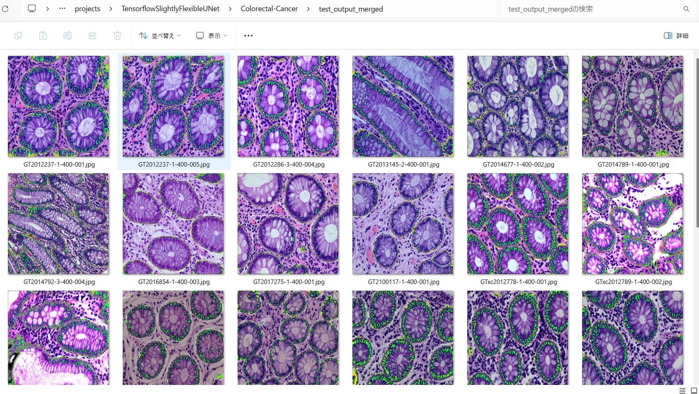

<h2>Tensorflow-Image-Segmentation-EBHI-SEG-Colorectal-Cancer (2024/04/05)</h2>

This is an experimental Image Segmentation project for Colorectal-Cancer based on
the <a href="https://github.com/sarah-antillia/Tensorflow-Image-Segmentation-API">Tensorflow-Image-Segmentation-API</a>, and
<a href="https://drive.google.com/file/d/1C5nxQTAcg28CP3QDiF8gzjEuvaeIu0FP/view?usp=sharing">
EBHI-SEG-Colorectal-Cancer-ImageMask-Dataset-V1.zip</a>.
 

 
Segmentation for test images of 512x512 size by <a href="./src/TensorflowUNet.py">TensorflowSlightlyFlexibleUNet</a> Model 

 
 
In this experiment, we have used the simple UNet Model 
<a href="./src/TensorflowUNet.py">TensorflowSlightlyFlexibleUNet</a> for this Colorectal-Cancer Segmentation. 
As shown in <a href="https://github.com/sarah-antillia/Tensorflow-Image-Segmentation-API">Tensorflow-Image-Segmentation-API</a>.
you may try other Tensorflow UNet Models: 

<li><a href="./src/TensorflowSwinUNet.py">TensorflowSwinUNet.py</a></li>
<li><a href="./src/TensorflowMultiResUNet.py">TensorflowMultiResUNet.py</a></li>
<li><a href="./src/TensorflowAttentionUNet.py">TensorflowAttentionUNet.py</a></li>
<li><a href="./src/TensorflowEfficientUNet.py">TensorflowEfficientUNet.py</a></li>
<li><a href="./src/TensorflowUNet3Plus.py">TensorflowUNet3Plus.py</a></li>
 

<h3>1. Dataset Citation</h3>
The dataset used here has been taken from the following figshare.com:EBHI-SEG 
<pre>
https://figshare.com/articles/dataset/EBHI-SEG/21540159/1
</pre>
About dataset 
<pre>
This publicly available dataset contained 5,170 images of six types of tumor differentiation stages 
and the corresponding ground truth images. 
The dataset can provide researchers with new segmentation algorithms for medical diagnosis of colorectal 
cancer, which can be used in the clinical setting to help doctors and patientsThe dataset in the present 
study contained 5,710 histopathology images, including 2,855 histopathology section images and 2,855 
ground truth images.
</pre>

Please see also: 
<b>EBHI-Seg: A novel enteroscope biopsy histopathological hematoxylin and eosin image dataset for image segmentation tasks</b>
<pre>
https://www.frontiersin.org/articles/10.3389/fmed.2023.1114673/full
</pre>
 

<h3>
<a id="2">
2. EBHI-SEG-Colorectal-Cancer ImageMask Dataset
</a>
</h3>
 If you would like to train this Colorectal-Cancer Segmentation model by yourself,
 please download the latest normalized dataset from the google drive 
<a href="https://drive.google.com/file/d/1C5nxQTAcg28CP3QDiF8gzjEuvaeIu0FP/view?usp=sharing">
EBHI-SEG-Colorectal-Cancer-ImageMask-Dataset-V1.zip</a>.
<!--
Please refer to the dataset augmentation tool 
<a href="https://github.com/sarah-antillia/ImageMask-Dataset-Colorectal-Cancer">ImageMask-Dataset-Colorectal-Cancer</a>.
-->
 

 
Please expand the downloaded ImageMaskDataset and place them under <b>./dataset</b> folder to be
<pre>
./dataset
└─EBHI-SEG-Colorectal-Cancer
    ├─Adenocarcinoma
    │  ├─test
    │  │  ├─images
    │  │  └─masks
    │  ├─train
    │  │  ├─images
    │  │  └─masks
    │  └─valid
    │      ├─images
    │      └─masks
    ├─High-grade IN
    │  ├─test
    │  │  ├─images
    │  │  └─masks
    │  ├─train
    │  │  ├─images
    │  │  └─masks
    │  └─valid
    │      ├─images
    │      └─masks
    ├─Low-grade IN
    │  ├─test
    │  │  ├─images
    │  │  └─masks
    │  ├─train
    │  │  ├─images
    │  │  └─masks
    │  └─valid
    │      ├─images
    │      └─masks
    ├─Normal
    │  ├─test
    │  │  ├─images
    │  │  └─masks
    │  ├─train
    │  │  ├─images
    │  │  └─masks
    │  └─valid
    │      ├─images
    │      └─masks
    ├─Polyp
    │  ├─test
    │  │  ├─images
    │  │  └─masks
    │  ├─train
    │  │  ├─images
    │  │  └─masks
    │  └─valid
    │      ├─images
    │      └─masks
    └─Serrated adenoma
        ├─test
        │  ├─images
        │  └─masks
        ├─train
        │  ├─images
        │  └─masks
        └─valid
            ├─images
            └─masks
</pre>
Please note that the pixel size of images and masks files in this dataset is 512x512, while the original EBHI-SEG dataset is 224x224
  
In this experiment,for simplicity, we deal with <b>Polyp</b> category only. 
 
<b>Colorectal-Cancer Polyp Statistics</b> 
 
 
As shown above, the number of images of train and valid dataset is not necessarily large. Probably, an online dataset augmentation
strategy may be effective to improve segmentation accuracy.
 

 
<b>Polyp_train_images_sample</b> 

 
<b>Polyp_train_masks_sample</b> 

 

<h2>
3. Train TensorflowUNet Model
</h2>
 We have trained Colorectal-Cancer TensorflowUNet Model by using the following
<a href="./projects/TensorflowSlightlyFlexibleUNet/EBHI-SEG-Colorectal-Cancer/train_eval_infer.config"> <b>train_eval_infer.config</b></a> file.  
Please move to ./projects/Colorectal-Cancer and run the following bat file. 
<pre>
>1.train.bat
</pre>
, which simply runs the following command. 
<pre>
>python ../../../src/TensorflowUNetTrainer.py ./train_eval_infer.config
</pre>

<pre>
; train_eval_infer.config
; 2024/04/05 (C) antillia.com

[model]
model         = "TensorflowUNet"
generator     = False
image_width    = 512
image_height   = 512
image_channels = 3
input_normalize = True
num_classes    = 1
base_filters   = 16
base_kernels   = (5,5)
num_layers     = 7
dropout_rate   = 0.08
learning_rate  = 0.0001
clipvalue      = 0.5
dilation       = (2,2)
;loss          = "bce_iou_loss"
loss           = "bce_dice_loss"
metrics        = ["binary_accuracy"]
;metrics        = ["iou_coef"]

show_summary   = False

[train]
epochs        = 100
batch_size    = 4
patience      = 10
;metrics       = ["iou_coef", "val_iou_coef"]
metrics       = ["binary_accuracy", "val_binary_accuracy"]
model_dir     = "./models"
eval_dir      = "./eval"
image_datapath = "../../../dataset/EBHI-SEG-Colorectal-Cancer/Polyp/train/images/"
mask_datapath  = "../../../dataset/EBHI-SEG-Colorectal-Cancer/Polyp/train/masks/"
create_backup  = False
learning_rate_reducer = True
reducer_patience      = 5
save_weights_only = True

[eval]
image_datapath = "../../../dataset/EBHI-SEG-Colorectal-Cancer/Polyp/valid/images/"
mask_datapath  = "../../../dataset/EBHI-SEG-Colorectal-Cancer/Polyp/valid/masks/"

[test] 
image_datapath = "../../../dataset/EBHI-SEG-Colorectal-Cancer/Polyp/test/images/"
mask_datapath  = "../../../dataset/EBHI-SEG-Colorectal-Cancer/Polyp/test/masks/"

[infer] 
images_dir    = "../../../dataset/EBHI-SEG-Colorectal-Cancer/Polyp/test/images/"
output_dir    = "./test_output"
merged_dir    = "./test_output_merged"
binarize      = True

[segmentation]
colorize      = False
black         = "black"
white         = "green"
blursize      = None

[mask]
blur      = True
blur_size = (3,3)
binarize  = False
threshold = 128
</pre>
The training process has just been stopped at epoch 42 by an early-stopping callback as shown below.  
 
 
 
<a href="./projects/TensorflowSlightlyFlexibleUNet/EBHI-SEG-Colorectal-Cancer/eval/train_metrics.csv">train_metrics.csv</a> 
 

 
<a href="./projects/TensorflowSlightlyFlexibleUNet/EBHI-SEG-Colorectal-Cancer/eval/train_losses.csv">train_losses.csv</a> 
 
 

<h3>
4. Evaluation
</h3>
Please move to a <b>./projects/TensorflowSlightlyFlexibleUNet/EBHI-SEG-Colorectal-Cancer</b> folder, 
and run the following bat file to evaluate TensorflowUNet model for Colorectal-Cancer. 
<pre>
./2.evaluate.bat
</pre>
<pre>
python ../../../src/TensorflowUNetEvaluator.py ./train_eval_infer_aug.config
</pre>
Evaluation console output: 

  
<a href="./projects/TensorflowSlightlyFlexibleUNet/EBHI-SEG-Colorectal-Cancer/evaluation.csv">evaluation.csv</a> 
The loss score (bce_dice_loss) for this test dataset is relatively low as shown below, and binary_accuracy is not so high.
Of course, you may try an online dataset augmentation or other segmentation models. 
<pre>
loss,0.1152
binary_accuracy,0.9442
</pre>

<h2>
5. Inference
</h2>
Please move to a <b>./projects/TensorflowSlightlyFlexibleUNet/EBHI-SEG-Colorectal-Cancer</b> folder 
,and run the following bat file to infer segmentation regions for images by the Trained-TensorflowUNet model for Colorectal-Cancer. 
<pre>
./3.infer.bat
</pre>
<pre>
python ../../../src/TensorflowUNetInferencer.py ./train_eval_infer_aug.config
</pre>

Polyp test_images 
 
Polyp_test_mask(ground_truth) 
 

Inferred test masks 
 
 
Merged test images and inferred masks  
  

Enlarged samples 
<table>
<tr>
<td>
test/image GT2012237-1-400-001.jpg 

</td>
<td>
Inferred merged GT2012237-1-400-001.jpg 

</td> 
</tr>

<tr>
<td>
test/image GT2012286-3-400-004.jpg 

</td>
<td>
Inferred merged GT2012286-3-400-004.jpg 

</td> 
</tr>

<tr>
<td>
test/image GT2014677-1-400-002.jpg 

</td>
<td>
Inferred merged GT2014677-1-400-002.jpg 

</td> 
</tr>

<tr>
<td>
test/image GT2016854-1-400-003.jpg 

</td>
<td>
Inferred merged GT2016854-1-400-003.jpg 

</td> 
</tr>

<tr>
<td>
test/image GTxc2012796-2-400-002.jpg 

</td>
<td>
Inferred merged GTxc2012796-2-400-002.jpg 

</td> 
</tr>

</table>
 

<h3>
References
</h3>
<b>1. EBHI-SEG</b> 
figshare.com 
<pre>
https://figshare.com/articles/dataset/EBHI-SEG/21540159/1
</pre>
About dataset 
<pre>
This publicly available dataset contained 5,170 images of six types of tumor differentiation stages 
and the corresponding ground truth images. 
The dataset can provide researchers with new segmentation algorithms for medical diagnosis of colorectal 
cancer, which can be used in the clinical setting to help doctors and patientsThe dataset in the present 
study contained 5,710 histopathology images, including 2,855 histopathology section images and 2,855 
ground truth images.
</pre>

<b>2. EBHI-Seg: A novel enteroscope biopsy histopathological hematoxylin and eosin image dataset for image segmentation tasks</b> 
Liyu Shi, Xiaoyan Li, Weiming Hu, Haoyuan Chen, Jing Chen, Zizhen Fan, Minghe Gao, Yujie Jing, 
 Guotao Lu1 Deguo Ma, Zhiyu Ma, Qingtao Meng, Dechao Tang, Hongzan Sun 

<pre>
https://www.frontiersin.org/articles/10.3389/fmed.2023.1114673/full
</pre>

